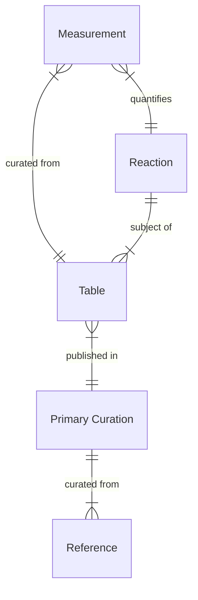
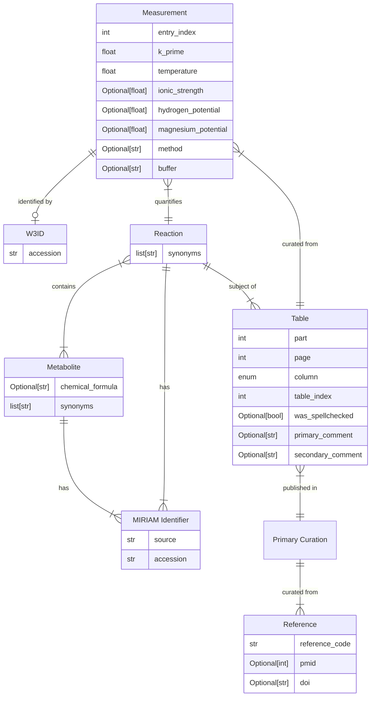

# Entity Model

The openTECR DB represents a re-curation of the data originally published by Goldberg
_et al._ (2016).

At the core of the openTECR data lies the curated `Measurement` entity. Each measurement
represents an attempt to quantify the apparent equilibrium constant [K'] of a
biochemical `Reaction` in a certain experimental `Condition` of the aqueous solution.
Each measurement was
curated from a `Table`, where each table
contains one or more measurements on one reaction. Each table was published as part
of the `Primary Curation` of information by Goldberg _et al._ (2016).

The above diagram shows the most important entities in the model and their
relationships. Below, we describe all entities and their attributes.

